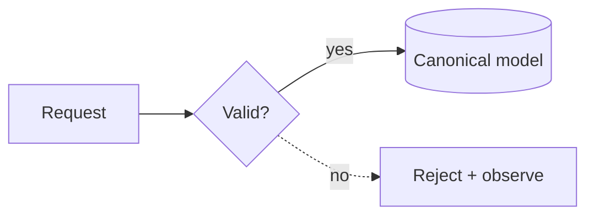

# Terminal Diagram Explainer

복잡한 소프트웨어 아키텍처·데이터·API·Worker 흐름을 터미널에서 한눈에 설명하도록 돕는 Codex 플러그인과 standalone renderer입니다.

구성은 두 부분으로 나뉩니다.

- `term-diagram`: 외부 Go 모듈, 네트워크, subprocess, CGO가 없는 bounded Flowchart → Unicode/ASCII renderer
- `terminal-diagram-explainer`: 한 줄 결론 → 도식 → 단계별 해설 → 개발 핵심 포인트 순으로 설명하는 Codex Skill

플러그인은 표현 방식만 추가하며 프로젝트의 `AGENTS.md`, SDLC, workflow 또는 repo-local Skill을 변경하지 않습니다.

## 지원 문법



- 방향: `LR`, `TD`, `TB`
- 노드: `ID`, `ID[label]`, `ID{decision}`, `ID[(data store)]`
- edge: `-->`, `-.->`, 선택적 `|label|`
- 한 줄 chain, `%%` 주석
- v0.1에서는 cycle, `classDef`, `subgraph`, HTML/Markdown label, sequence/ER diagram을 명시적으로 거부합니다.

## 개발 검증

```bash
GOTOOLCHAIN=local GOPROXY=off go test ./...
GOTOOLCHAIN=local GOPROXY=off go test -race ./...
GOTOOLCHAIN=local GOPROXY=off go vet ./...
GOTOOLCHAIN=local GOPROXY=off go list -m all
```

## 설치

Go 1.25 이상과 Codex CLI가 필요합니다. renderer는 `$CODEX_HOME/bin/term-diagram`에 설치됩니다.

```bash
scripts/install-local.sh
scripts/install-global-guidance.sh
codex plugin marketplace add ahwlsqja/terminal-diagram-explainer --ref main
codex plugin add terminal-diagram-explainer@terminal-diagrams
```

전역 기본 설명 선호가 필요하지 않으면 `scripts/install-global-guidance.sh`는 생략할 수 있습니다. 전역 `AGENTS.md` 전체 교체 후에는 이 스크립트만 다시 실행합니다.

자세한 입력·출력 경계는 [SECURITY.md](SECURITY.md), 문법은 [docs/GRAMMAR.md](docs/GRAMMAR.md), 확장 계획은 [docs/ROADMAP.md](docs/ROADMAP.md)를 참고합니다.
