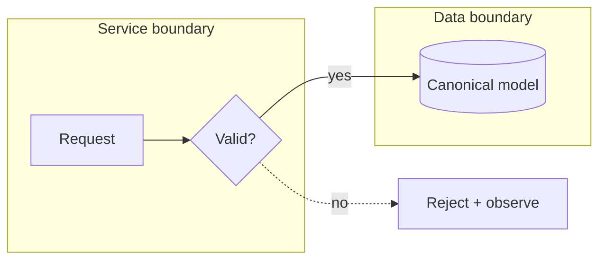
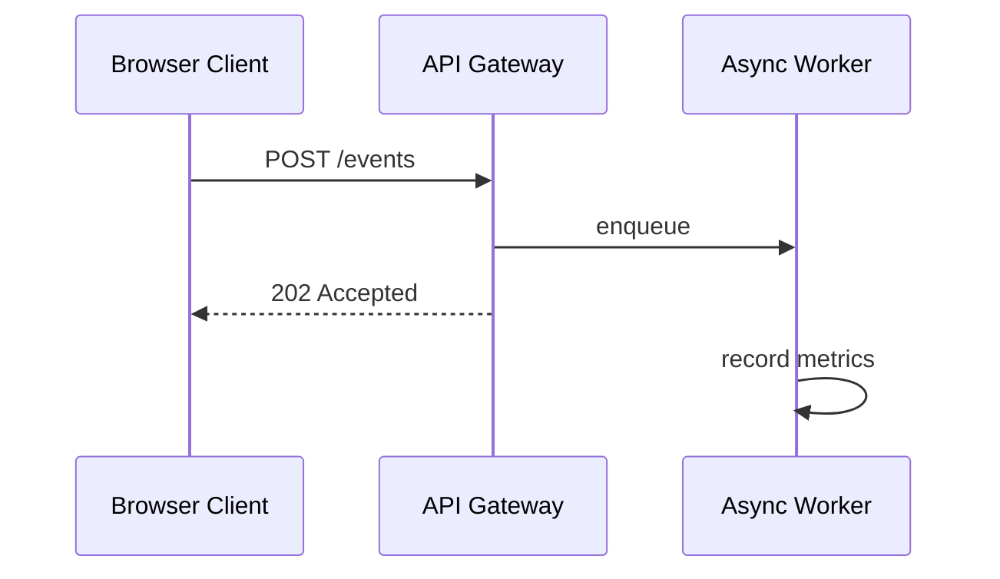
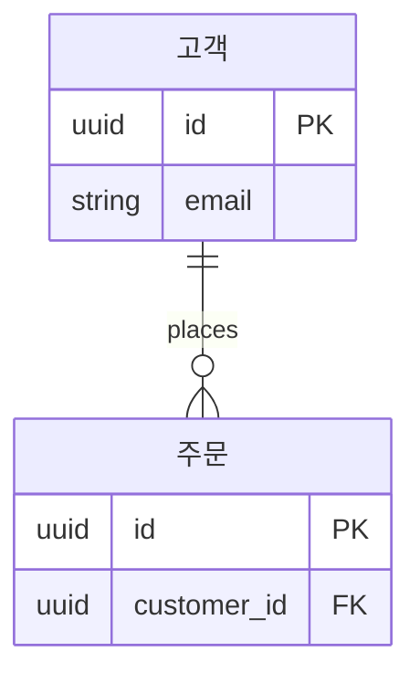

# Terminal Diagram Explainer

복잡한 소프트웨어 아키텍처·데이터·API·Worker 흐름을 터미널에서 한눈에 설명하도록 돕는 Codex 플러그인과 standalone renderer입니다.

구성은 두 부분으로 나뉩니다.

- `term-diagram`: 외부 Go 모듈, 네트워크, subprocess, CGO가 없는 bounded Flowchart·Sequence → Unicode/ASCII renderer
- `terminal-diagram-explainer`: 한 줄 결론 → 도식 → 단계별 해설 → 개발 핵심 포인트 순으로 설명하는 Codex Skill

플러그인은 표현 방식만 추가하며 프로젝트의 `AGENTS.md`, SDLC, workflow 또는 repo-local Skill을 변경하지 않습니다.

## 지원 문법



- 방향: `LR`, `TD`, `TB`
- 노드: `ID`, `ID[label]`, `ID{decision}`, `ID[(data store)]`
- edge: `-->`, `-.->`, 선택적 `|label|`
- 한 줄 chain, `%%` 주석
- subgraph: `subgraph ID`, `subgraph ID[label]`, 중첩 `end`
- node ID는 전체 graph에서 유일하며 각 node는 root 또는 하나의 subgraph에 직접 소속됩니다.
- cycle과 self-loop는 SCC 분석 후 외곽 feedback route로 렌더링하며 label은 `feedback:` legend에 표시합니다.
- 중간 rank를 건너뛰는 edge도 node 관통을 피하도록 외곽 route를 사용하며 label은 `routed:` legend에 표시합니다.
- cross-subgraph edge는 frame을 관통하지 않는 외곽 route를 사용하며 label은 `routed:` legend에 표시합니다.



- participant: `participant ID`, `participant ID as Label`
- message: request `->>`, return `-->>`, 첫 `:` 뒤의 필수 label
- participant는 message보다 먼저 명시적으로 선언하며 source order가 lifeline 순서입니다.
- fan-out은 같은 sender의 연속 message, self-message는 같은 ID endpoint로 표현합니다.
- 최대 16 participants, 96 messages입니다.
- `loop label ... end`, `alt label ... else label ... end`, `opt label ... end`를 지원합니다.
- 모든 fragment branch는 message를 포함해야 하며 최대 32 fragments, 중첩 깊이 8, 전체 256 steps입니다.
- `activate ID`와 `deactivate ID`는 participant별 LIFO active interval을 표시합니다. 최대 96 activations, participant별 depth 8입니다.
- Activation pair 사이에는 message가 있어야 하고 fragment 시작·`else`·`end` 경계를 넘을 수 없습니다.
- `par label ... and label ... end`는 독립 branch를 source/display order로 보여줍니다. 이 세로 순서는 실제 동시 실행 순서나 happens-before를 뜻하지 않습니다.
- `par`는 최소 두 개의 nonempty branch를 요구하며 activation은 각 branch 안에서 완결되어야 합니다.



- Entity block은 `ID { ... }` 또는 `ID[display label] { ... }`입니다.
- Attribute는 `type name [PK] [FK]`이며 PK+FK 조합을 허용합니다.
- Cardinality marker는 `0..1`, `1`, `0..N`, `1..N` 네 종류를 명시합니다.
- Self·duplicate relationship과 disconnected entity를 지원합니다.
- 최대 32 entities, 64 relationships, attributes 총 192/entity당 32입니다.
- `classDef`, `style`, `click`, HTML/Markdown label, Sequence/ER note와 advanced ER semantics는 아직 명시적으로 거부합니다.

## 개발 검증

```bash
GOTOOLCHAIN=local GOPROXY=off go test ./...
GOTOOLCHAIN=local GOPROXY=off go test -race ./...
GOTOOLCHAIN=local GOPROXY=off go vet ./...
GOTOOLCHAIN=local GOPROXY=off go list -m all
```

## 설치

Go 1.25 이상과 Codex CLI가 필요합니다. renderer는 `$CODEX_HOME/bin/term-diagram`에 설치됩니다.

```bash
scripts/install-local.sh
scripts/install-global-guidance.sh
codex plugin marketplace add ahwlsqja/terminal-diagram-explainer --ref main
codex plugin add terminal-diagram-explainer@terminal-diagrams
```

전역 기본 설명 선호가 필요하지 않으면 `scripts/install-global-guidance.sh`는 생략할 수 있습니다. 전역 `AGENTS.md` 전체 교체 후에는 이 스크립트만 다시 실행합니다.

자세한 입력·출력 경계는 [SECURITY.md](SECURITY.md), 문법은 [docs/GRAMMAR.md](docs/GRAMMAR.md), 확장 계획은 [docs/ROADMAP.md](docs/ROADMAP.md)를 참고합니다.
